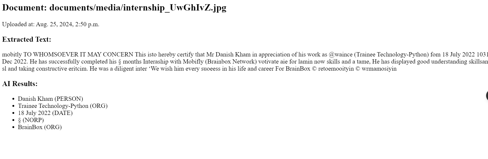

\\wsl.localhost\Ubuntu-24.04\home\django\doc_processing

sudo apt update
sudo apt install python3-pip
pip3 install virtualenv

virtualenv mvenv
source myenv/bin/activate

pip install pytesseract pillow spacy
python -m spacy download en_core_web_sm

Make sure Tesseract is installed on your system. For example, on Ubuntu:
sudo apt-get install tesseract-ocr




# Intelligent Document Processing System

This project is an Intelligent Document Processing System built using Django, Python OCR, and AI libraries, with MySQL/MariaDB as the database backend. The system allows users to upload documents (PDFs, images), extract text using OCR, analyze the text using AI models (e.g., Named Entity Recognition, Text Classification, Sentiment Analysis), and store the results in a database.

## Prerequisites

- Python 3.8+
- Django 5.1
- MySQL/MariaDB
- [Tesseract OCR](https://github.com/tesseract-ocr/tesseract) installed and added to PATH
- Virtualenv (recommended)

## Installation

1. **Clone the repository:**

    ```bash
    git clone https://github.com/khand420/doc_processing.git
    cd doc_processing
    ```

2. **Create and activate a virtual environment:**

    ```bash
    python -m venv mvenv
    source mvenv/bin/activate  # On Windows: mvenv\Scripts\activate
    ```

3. **Install dependencies:**

    ```bash
    pip install -r requirements.txt
    ```

4. **Install additional libraries:**

    - Hugging Face Transformers for text classification:
  
      ```bash
      pip install transformers
      ```

    - TextBlob for sentiment analysis:
  
      ```bash
      pip install textblob
      python -m textblob.download_corpora
      ```

5. **Set up the MySQL/MariaDB database:**

    - Create a database for your project.
    - Update the `DATABASES` configuration in `settings.py`:

    ```python
    DATABASES = {
        'default': {
            'ENGINE': 'django.db.backends.mysql',
            'NAME': 'your_database_name',
            'USER': 'your_username',
            'PASSWORD': 'your_password',
            'HOST': 'localhost',
            'PORT': '3306',
        }
    }
    ```

6. **Apply migrations:**

    ```bash
    python manage.py migrate
    ```

7. **Create a superuser (admin account):**

    ```bash
    python manage.py createsuperuser
    ```

## Running the Application

1. **Start the development server:**

    ```bash
    python manage.py runserver
    ```

2. **Access the application:**

    - Login: `http://127.0.0.1:8000/accounts/login/`
    - Register: `http://127.0.0.1:8000/accounts/signup/`
    - Upload documents: `http://127.0.0.1:8000/documents/upload/`

## Processing Workflow

- **OCR Integration:** Uses Tesseract OCR to extract text from uploaded documents.
- **AI Processing:**
  - **Named Entity Recognition (NER):** Identifies and classifies entities using spaCy.
  - **Text Classification:** Categorizes documents using Hugging Face's Transformers.
  - **Sentiment Analysis:** Analyzes sentiment using TextBlob.

## Additional Notes

- **Tesseract OCR Path:** Ensure Tesseract is installed and accessible. Specify the Tesseract executable path if needed.
- **Customization:** Modify the AI processing logic in `process_ai` function to use custom models if required.

## Testing

1. **Run tests:**

    ```bash
    python manage.py test
    ```

## License

This project is licensed under the MIT License.
